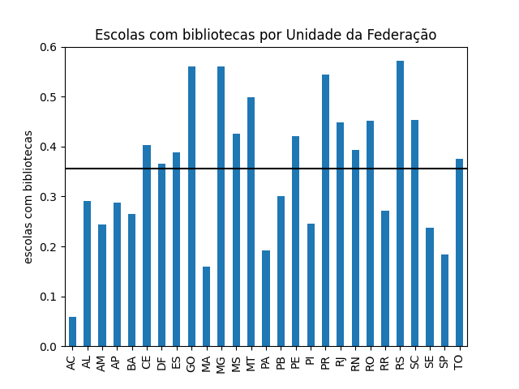
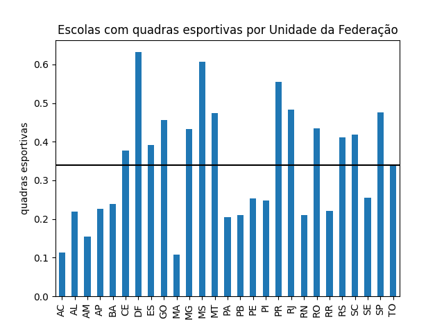

# Relação das dependências das escolas com seu estado

## 1- Bibliotecas por região 

A partir deste gráfico, podemos observar que o estado de Minas Gerais se destaca quando se trata da presença de bibliotecas em suas escolas. O estado abrange um total de 853 municípios, com uma média de aproximadamente 11,35 bibliotecas por município e um desvio padrão de 40,3. Notavelmente, Belo Horizonte se destaca como o município com o maior número de escolas que possuem bibliotecas, alcançando a impressionante marca de 1.027 escolas.

## 2-Dormitórios para alunos

Com este outro gráfico, observamos que Minas Gerais também se destaca na quantidade de dormitórios disponíveis para os alunos, com uma média de 0,64 dormitórios por município e um desvio padrão de 2,65. Isso sugere que a presença de dormitórios fornecidos pelas escolas não é comum. Novamente, Belo Horizonte chama a atenção ao liderar com a maior quantidade de dormitórios, totalizando 69 enqunto muitos outros municípios não possuem esse tipo de instalação.

## 3- Banheiros adptados

Com base nestes dados, fica evidente que o estado de São Paulo lidera em termos de quantidade de banheiros adaptados em escolas em todo o Brasil. Essa liderança faz sentido, considerando a grande população do estado. Dos 645 municípios que participaram dessas estatísticas, São Paulo tem uma média de aproximadamente 24,5 escolas com banheiros adaptados por município. No entanto, é importante notar que o desvio padrão é relativamente alto, medindo 133,7, o que sugere uma concentração dessas escolas em alguns poucos municípios.

Nesse contexto, chama a atenção a capital do estado, São Paulo, que se destaca com um impressionante total de 3.264 escolas com banheiros adaptados.

## 4- Quadras esportivas

Nestes dados, podemos observar que o estado de São Paulo se destaca como o líder em número de quadras esportivas em escolas em todo o Brasil. Esse destaque é coerente com a grande população do estado. Dos 645 municípios que contribuíram com esses dados, São Paulo possui, em média, cerca de 24,5 quadras esportivas por município. Entretanto, é relevante notar que o desvio padrão é considerável, chegando a 134,4, indicando uma variação significativa na distribuição dessas quadras, com uma concentração maior em alguns poucos municípios.

Destacando-se mais uma vez, a cidade de São Paulo surge como líder no número de quadras esportivas, com um total impressionante de 3.309 unidades.

## 5- Dormitórios para professores
 

Nestes dados, é evidente que o estado do Pará se destaca em relação à quantidade de dormitórios para professores em escolas. O Pará registra uma média de cerca de 2,42 dormitórios por município, com um desvio padrão de 6,26. No entanto, vale ressaltar que a presença de dormitórios para professores não é comum em muitos municípios.

Dentre esses municípios, merece destaque o município de Portel, que lidera com a maior quantidade de dormitórios para professores, registrando um máximo de 55 dormitórios. Portanto, enquanto o Pará se sobressai na média de dormitórios, a presença dessas instalações varia consideravelmente entre os municípios, com Portel se destacando como líder nesse quesito.

## DataFrame com todos os dados usados 

| SG_UF   |   IN_BANHEIRO_PNE |   IN_BIBLIOTECA |   IN_DORMITORIO_ALUNO |   IN_DORMITORIO_PROFESSOR |   IN_QUADRA_ESPORTES |
|:--------|------------------:|----------------:|----------------------:|--------------------------:|---------------------:|
| AC      |               428 |              92 |                    20 |                        99 |                  179 |
| AL      |              1320 |             883 |                   109 |                        26 |                  671 |
| AM      |              1064 |            1339 |                    70 |                       238 |                  860 |
| AP      |               336 |             258 |                    11 |                       170 |                  200 |
| BA      |              5996 |            4652 |                   458 |                       327 |                 4207 |
| CE      |              3621 |            3174 |                   189 |                        54 |                 2947 |
| DF      |              1195 |             474 |                    95 |                        18 |                  817 |
| ES      |              1825 |            1271 |                    66 |                        23 |                 1282 |
| GO      |              3188 |            2726 |                   207 |                        72 |                 2216 |
| MA      |              3267 |            1935 |                   201 |                        70 |                 1304 |
| MG      |              8303 |            9688 |                   548 |                       152 |                 7499 |
| MS      |              1399 |             773 |                    80 |                        35 |                 1112 |
| MT      |              1870 |            1438 |                    99 |                        45 |                 1364 |
| PA      |              3293 |            2092 |                   111 |                       348 |                 2238 |
| PB      |              2318 |            1507 |                   170 |                        31 |                 1055 |
| PE      |              3622 |            3566 |                   147 |                        43 |                 2154 |
| PI      |              1791 |            1154 |                    77 |                        72 |                 1173 |
| PR      |              6774 |            5312 |                   224 |                        37 |                 5407 |
| RJ      |              6515 |            5253 |                   357 |                       103 |                 5660 |
| RN      |              1894 |            1535 |                   114 |                        31 |                  826 |
| RO      |               840 |             593 |                    33 |                        49 |                  570 |
| RR      |               265 |             238 |                    16 |                         5 |                  195 |
| RS      |              5363 |            5978 |                   368 |                        68 |                 4301 |
| SC      |              3951 |            3138 |                   197 |                        20 |                 2900 |
| SE      |              1304 |             520 |                    45 |                         8 |                  559 |
| SP      |             15775 |            5718 |                   295 |                        35 |                14747 |
| TO      |               880 |             675 |                    53 |                        24 |                  611 |