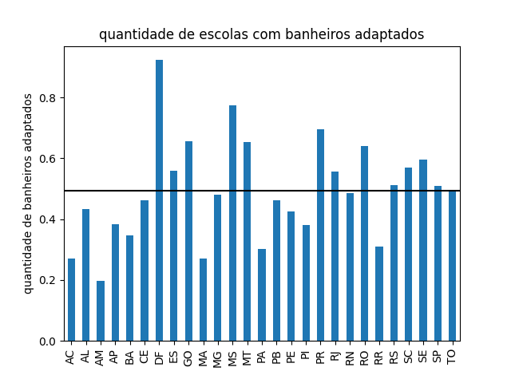
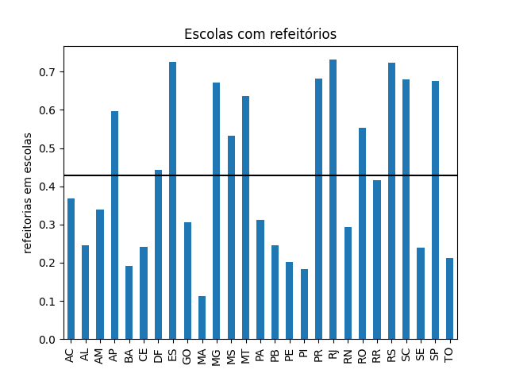

# Relação das dependências das escolas com seu estado

## 1- Bibliotecas por região 

  

A análise dos dados revela que o estado do Acre apresenta a menor proporção de escolas com bibliotecas em comparação com os demais estados brasileiros. Em média, o Acre tem cerca de 4,18 bibliotecas por município, com um desvio padrão significativo de 11,05. Essa situação pode ser atribuída, em grande parte, à escassez de recursos disponíveis no estado em comparação com outras regiões do Brasil.

A falta de recursos financeiros pode ser um fator determinante na dificuldade de estabelecer e manter bibliotecas nas escolas do Acre.

Nesse cenário, é interessante observar que a capital do estado, Rio Branco, lidera em termos de quantidade de escolas com bibliotecas, contabilizando 53 unidades. Essa concentração em uma área urbana pode indicar que os recursos destinados à educação, incluindo bibliotecas, são direcionados principalmente para a capital, enquanto áreas rurais e mais remotas podem ter acesso limitado a esses recursos.

## 2-Banheiros adaptados

Com base no gráfico, podemos ver que o Amazonas tem uma proporção baixa de escolas com banheiros adaptados. A média é de apenas 14.99 escolas por município, com um desvio padrão considerável de 32.11. Essa situação pode ser atribuída à vasta extensão geográfica do estado, que inclui áreas rurais e remotas de difícil acesso.

Essas áreas distantes e a diversidade geográfica podem tornar a construção e manutenção de banheiros adaptados uma tarefa desafiadora e cara. No entanto, a capital, Manaus, se destaca com a maior quantidade de escolas com banheiros adaptados, totalizando 430. Isso pode indicar uma disparidade entre áreas urbanas e rurais em termos de acessibilidade a essas instalações.

## 3- Dormitórios para alunos  

Este gráfico evidencia que São Paulo apresenta uma proporção relativamente baixa de escolas com dormitórios para alunos em relação ao total de escolas existentes no estado. A média é de apenas 0.45 escolas com dormitórios por município, com um desvio padrão de 2.4. Isso indica que a presença de dormitórios nas escolas varia consideravelmente de município para município em São Paulo.

Essa situação sugere que, em um estado altamente desenvolvido como São Paulo, a maioria das escolas pode não considerar dormitórios para alunos uma necessidade, uma vez que os alunos geralmente não precisam pernoitar nas escolas. Isso reflete a infraestrutura e o acesso à educação de qualidade em todo o estado.

No entanto, é importante destacar que a capital do estado, São Paulo, se destaca com 62 escolas que oferecem dormitórios para alunos. Isso pode ser atribuído à grande população da capital e à presença de escolas de diferentes tipos e finalidades, incluindo aquelas que oferecem acomodações para estudantes de outras localidades.

## 4- Refeitórios escolares

Com base nesse gráfico, podemos observar que o estado do Maranhão possui a menor proporção de escolas com refeitórios em relação ao número total de escolas. A média de escolas com refeitórios por município é de apenas 6.23, com um desvio padrão consideravelmente alto, chegando a 23.49. Isso indica que a presença de refeitórios em escolas varia significativamente de um município para outro no estado do Maranhão.

Essa variação pode ser atribuída a diversos fatores, como a disponibilidade de recursos financeiros, infraestrutura, políticas educacionais locais e até mesmo o tamanho e a população de cada município. Apesar da média relativamente baixa, é importante destacar que São Luís, a capital do estado, se destaca com um total de 326 escolas que possuem refeitórios.

Essa discrepância na presença de refeitórios nas escolas reflete as diferenças socioeconômicas e geográficas dentro do estado do Maranhão. 

## 5- Quadras esportivas
 

O gráfico evidencia mais uma vez a situação no estado do Maranhão, que apresenta a menor proporção de escolas com quadras esportivas em relação ao número total de escolas. A média de escolas com quadras esportivas por município no estado é de apenas 5.98, com um significativo desvio padrão de 19.8. Isso demonstra uma considerável variação na presença de quadras esportivas em escolas, mesmo com uma média relativamente baixa.

Essa disparidade na disponibilidade de quadras esportivas pode ser atribuída a diversos fatores, incluindo desigualdades regionais, recursos financeiros, políticas educacionais locais e características demográficas. Como mencionado anteriormente, São Luís, a capital do Maranhão, destaca-se mais uma vez, com um total de 274 escolas que possuem quadras esportivas.

## Conclusão

Com base na análise dos dados apresentados, podemos concluir que os investimentos em instalações escolares variam consideravelmente de acordo com os estados e municípios do Brasil. Essas variações podem ser atribuídas a uma série de fatores, incluindo recursos financeiros disponíveis, políticas educacionais locais, densidade populacional e demanda por serviços educacionais.

## DataFrame com todos os dados usados 

|    | SG_UF   |   IN_BANHEIRO_PNE |   IN_BIBLIOTECA |   IN_DORMITORIO_ALUNO |   IN_REFEITORIO |   IN_QUADRA_ESPORTES |
|---:|:--------|------------------:|----------------:|----------------------:|----------------:|---------------------:|
|  0 | AC      |               427 |              92 |                    20 |             582 |                  179 |
|  1 | AL      |              1310 |             877 |                   109 |             741 |                  664 |
|  2 | AM      |              1041 |            1293 |                    69 |            1798 |                  823 |
|  3 | AP      |               335 |             252 |                    11 |             523 |                  199 |
|  4 | BA      |              5839 |            4462 |                   440 |            3210 |                 4009 |
|  5 | CE      |              3607 |            3151 |                   189 |            1883 |                 2942 |
|  6 | DF      |              1193 |             473 |                    95 |             573 |                  816 |
|  7 | ES      |              1823 |            1270 |                    66 |            2374 |                 1280 |
|  8 | GO      |              3168 |            2705 |                   206 |            1474 |                 2201 |
|  9 | MA      |              3254 |            1918 |                   200 |            1353 |                 1298 |
| 10 | MG      |              8286 |            9658 |                   547 |           11601 |                 7479 |
| 11 | MS      |              1383 |             760 |                    80 |             951 |                 1083 |
| 12 | MT      |              1861 |            1421 |                    98 |            1811 |                 1353 |
| 13 | PA      |              3280 |            2079 |                   111 |            3385 |                 2226 |
| 14 | PB      |              2306 |            1498 |                   170 |            1223 |                 1050 |
| 15 | PE      |              3602 |            3546 |                   147 |            1700 |                 2143 |
| 16 | PI      |              1784 |            1149 |                    77 |             864 |                 1164 |
| 17 | PR      |              6743 |            5276 |                   223 |            6614 |                 5381 |
| 18 | RJ      |              6466 |            5203 |                   356 |            8491 |                 5614 |
| 19 | RN      |              1885 |            1526 |                   113 |            1137 |                  820 |
| 20 | RO      |               835 |             588 |                    33 |             720 |                  565 |
| 21 | RR      |               258 |             227 |                    16 |             347 |                  185 |
| 22 | RS      |              5336 |            5943 |                   368 |            7527 |                 4276 |
| 23 | SC      |              3939 |            3128 |                   197 |            4696 |                 2894 |
| 24 | SE      |              1304 |             520 |                    45 |             523 |                  559 |
| 25 | SP      |             15695 |            5645 |                   293 |           20841 |                14655 |
| 26 | TO      |               877 |             671 |                    53 |             379 |                  607 |
