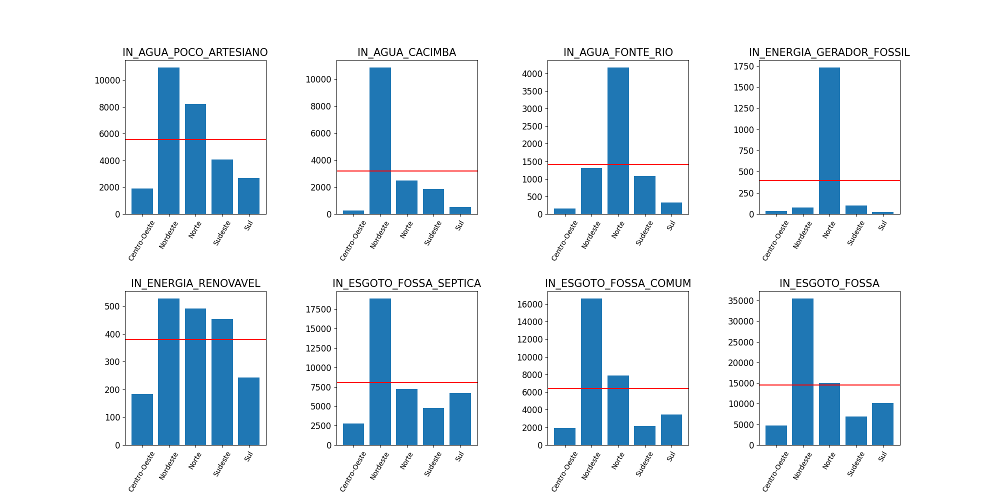
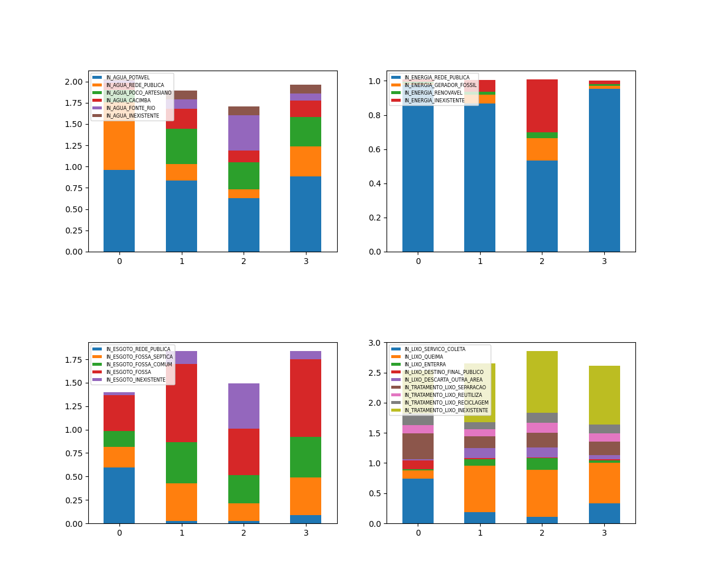
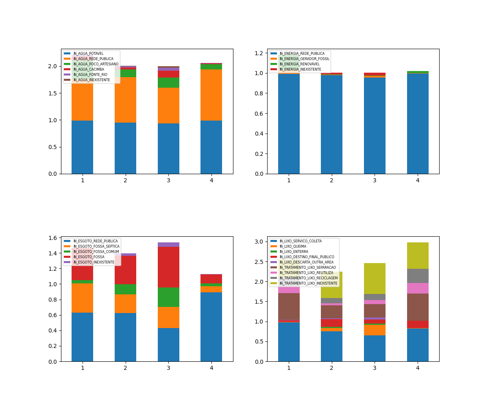

# ANÁLISE DOS RECURSOS ECOLÓGICOS PRESENTES NAS ESCOLAS BRASILEIRAS EM 2021

Nessa análise, serão abordados os aspectos descritivos e correlativos entre as instituições escolares dos diferentes locais e tipos e a distribuição dos recursos ecológicos (água, energia, esgoto e tratamento de lixo) nas mesmas.

A base de dados utilizada foi:

[dar um jeito de colocar base de dados aqui kkkkkk]

Para mais detalhes sobre o que cada coluna representa, consulte o dicionário de dados.

Essas análises foram retiradas dos prints e dos datasets e imagens salvos do arquivo _analise.py_. Para mais detalhes, confira o arquivo presente neste mesmo diretório.

## ANÁLISE DESCRITIVA

Primeiramente, vamos abordar o ponto de vista descritivo para efetuar a análise de como é distribuido os recursos ecológicos nas escolas do país. As medidas estatísticas utilizadas foram o mínimo, o máximo, a média, a mediana e o desvio padrão.

De modo geral, temos os seguintes dados estatísticos a cerca de cada um dos indicadores

- Por região:

- Por estado:

Analisando, inicialmente, a quantidade de escolas (por região e por estado) que recebem água potável, temos as seguintes situações:

- Por regiões:

- Por estados:

Observa-se que há uma enorme quantidade de escolas em São Paulo que recebem água potável em relação ao demais estados (cerca de 30000), elevando assim a quantidade de escolas que recebem água potável na Região Sudeste, conforme ocorre nos gráficos acima. Além disso, Minas Gerais e Rio de Janeiro também contribuem fortemente para essa quantidade. Em seguida, vemos o Nordeste em segunda posição, com água potável em maior quantidade em escolas da Bahia, Maranhão, Pernambuco e Paraíba (todos abaixo de 15000). Por fim, vê-se que as três regiões restantes encontram-se em menor quantidade, mas isto não significa que elas tem menos em proporção, pois devemos levar em conta a extensão terriorial (muito rebaixada no Sul e no Centro-Oeste) e a quantidade de escolas existentes (muito rebaixada no Norte e no Centro-Oeste).

Analisando agora, a quantidade de escolas (por região e por estado) que recebem água, energia e possuem esgoto e tratamento de lixo de caráter dado pela rede pública, temos as seguintes situações:

- Por regiões:

- Por estados:

Novamente, observamos São Paulo com forte destaque em todos os quesitos, com acompanhamento considerável de Minas Gerais e Rio de Janeiro. A Região Nordeste, ganhando destaque nesses quesitos graças a Bahia, Pernambuco e Maranhão e as demais regiões sem consideráveis posições, valendo a observação mencionada anteriormente. Ademais, convém mencionar a forte expressividade de São Paulo no quesito de escolha do destino final do lixo por meio do poder público.

A fim de analisar a ausência desses recursos para entender se, de fato, as regiões menos expressivas estão de fato em condições precárias no ambiente de ensino, temos as seguintes situações:

- Por regiões:

- Por estados:

Nesse caso, a Região Sudeste perde a expressividade, exceto no tratamento de lixo, onde vemos que a quantidade de escolas que não tem tratamento do lixo é relativamente alta (principalmente em São Paulo, mas também em Minas Gerais e Rio de Janeiro). A Região Nordeste tem também diversas escolas sem abastecimento de água, sem esgoto e sem tratamento de lixo, muito frequentes na Bahia, Maranhão e Paraíba. A Região Norte também demonstra ter muitas escolas sem água, energia e esgoto (principalmente no Amazonas e no Acre), que deve ocorrer por diversos fatores, que podem ser geograficos, economicos ou mesmo historico-sociais. Por fim, as regiões Centro-Oeste e Sul se mantém em valores baixos, o que indica uma baixa quantidade de escolas sem algum destes indicadores, caracterizando um grau de desenvolvimento, já que em proporção há bem mais escolas com esses indicadore do que sem.

Analisando agora meios alternativos de abastecimento de água e energia nas escolas, além de tipos diferentes de esgoto e tratamento de lixo nas escolas, temos as seguintes situações:

- Por regiões:

- Por estados:

[Colocar texto aqui rsrs]

Analisando os tipos de tratamento de lixo que ocorrem nas escolas, temos as seguintes situações:

- Por regiões:

- Por estados:

[Colocar texto aqui rsrs]

Analisando os tipos alternativos de destinos finais do lixo, temos as seguintes situações:

- Por regiões:

- Por estados:

[Colocar texto aqui rsrs]

## ANÁLISE CORRELATIVA

Agora, vamos analisar a correlação entre cada um dos indicadores e o tipo de localização em que as escolas se encontram (urbana e rural) ou localização diferenciada (assentamentos, terras indígenas e remanescentes de quilombos) e o tipo de dependência escolar (federal, estadual, pública e privada), a fim de inferir como ocorre a proporção em cada um destes.

## IDEIAS ADICIONAIS

Analisando a base de dados (principalmente do ponto de vista de municípios e escolas - colunas NO_MUNICIPIO e NO_ENTIDADE, respectivamente - que não foram utilizados no dataframe para as análises, já que as mesmas se limitaram a uma visão global por regiões ou estados), observa-se que podemos associar a cada linha, um vetor, onde cada coordenada representa um dos indicadores ecológicos em questão. A fim de encontrar cidades (ou mesmo escolas) que são semelhantes de um modo geral nesses indicadores, devemos efetuar a distância entre cada um dos vetores agrupá-las em grupos (clusters) que indiquem que elas são similares entre si. Entretanto, isso seria um trabalho um pouco demorado (foram feitos alguns testes e o código demorou horas e não terminou de rodar). Pesquisei sobre isso e descobri que a bibliotecas em python que fazem esse agrupamento (ou clusterização), como a função kmeans presente na biblioteca sklearn. Mas, pelo tempo escasso para entender essa biblioteca e por recomendações externas de não utilizar ela pois ela seria vista em um curso futuro (pelo menos em Ciência de Dados) de Aprendizado de Máquina, resolvi me abster e ficar apenas com a motivação. Mas pretendo pesquisar mais a fundo em detalhes sobre essa ideia.

